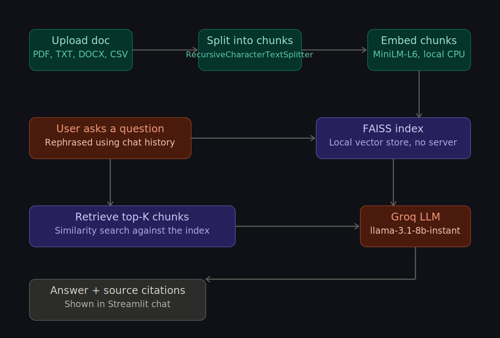

# 🧠 DocMind — Personal Document Q&A Agent

Chat with any PDF, TXT, DOCX, or CSV using a fully local RAG pipeline + a free LLM API. Built end-to-end and deployed live, with conversation memory and source citations.

**🔗 Live demo:** https://huggingface.co/spaces/Rohidh/doc-qa-agent



---

## What it does

Upload a document, ask questions about it in plain English, and get answers grounded in the actual text — with citations showing exactly which page or row the answer came from. Conversation memory means you can ask follow-ups like *"how was that measured?"* without repeating context.

- **Multi-format ingestion** — PDF, TXT, DOCX, CSV, parsed and chunked per-format
- **Local vector search** — FAISS index, no external vector DB, no server to manage
- **Conversational memory** — follow-up questions resolve pronouns and implicit context correctly
- **Source-grounded answers** — every response shows which document and page it pulled from
- **Configurable retrieval** — adjustable chunk size, overlap, and top-K directly in the UI

---

## Stack

| Layer | Tool | Why |
|---|---|---|
| LLM | [Groq](https://console.groq.com) — `llama-3.1-8b-instant` | Free tier, very low latency |
| Embeddings | HuggingFace `sentence-transformers/all-MiniLM-L6-v2` | Runs locally on CPU, no API cost |
| Vector store | FAISS | In-process, no server to provision |
| Orchestration | LangChain (`ConversationalRetrievalChain`) | Handles memory + retrieval-augmented prompting |
| UI | Streamlit | Fast to build, free to host |
| Hosting | Hugging Face Spaces | Free CPU tier, git-based deploys |

Total cost to build and run: **$0.**

---

## Try it locally

```bash
git clone <this-repo>
cd doc-qa-agent
python -m venv venv && source venv/bin/activate   # venv\Scripts\activate on Windows
pip install -r requirements.txt
streamlit run app.py
```

Paste a free [Groq API key](https://console.groq.com) into the sidebar, upload a document, and ask away. Full setup walkthrough, including Hugging Face Spaces deployment and Google Colab usage, is in [`SETUP.md`](SETUP.md).

---

## How it works

1. An uploaded document is parsed by format (PyMuPDF for PDF, python-docx for Word, csv for spreadsheets) and split into overlapping chunks with `RecursiveCharacterTextSplitter`.
2. Each chunk is embedded locally with `all-MiniLM-L6-v2` and indexed in FAISS — entirely in-memory, no external vector DB.
3. On each question, `ConversationalRetrievalChain` rewrites the query using prior chat turns (so "how was that measured?" becomes a standalone, searchable question), retrieves the top-K most similar chunks, and sends them to Groq's LLM alongside the question.
4. The answer streams back to the Streamlit UI along with chips showing exactly which document and page each cited fact came from.

```
doc-qa-agent/
├── app.py                     # Streamlit UI
├── requirements.txt
├── SETUP.md                   # Full install + deployment guide
└── src/
    ├── document_processor.py  # Format-aware loader + chunker
    ├── vector_store.py        # FAISS index + embeddings
    ├── qa_chain.py             # ConversationalRetrievalChain + memory
    └── utils.py                # Source formatting, file icons
```

---

## Lessons learned shipping this to production

The RAG pipeline itself came together quickly. Deploying it was where the real engineering happened — a useful reminder that "the demo works on my machine" and "the demo works in production" are different problems. A condensed log of what broke and why:

- **Dependency drift across the LangChain ecosystem.** `langchain.schema`, `langchain.text_splitter`, and `langchain_community.embeddings` have all been relocated as the LangChain project split into `langchain-core`, `langchain-community`, and provider-specific packages. Code written against one minor version silently breaks on the next. Fix: pin every LangChain-family package to versions from the same release window, not just the top-level `langchain` package.
- **A transitive client incompatibility.** `groq`'s underlying HTTP client dropped support for a `proxies` kwarg that `langchain-groq` was still passing internally — a `TypeError` that only surfaced at runtime, not install time. Fix: pass an explicit `httpx.Client()` instance to `ChatGroq` rather than relying on its default construction.
- **Build vs. runtime errors look identical in the UI but aren't.** Hugging Face Spaces shows build failures (bad `requirements.txt`, Docker layer issues) and runtime tracebacks (`ModuleNotFoundError`, app exceptions) in visually similar red panels. Learning to check the **Logs → Build** tab versus **Logs → Container** tab separately cut debugging time significantly.
- **Git history isn't forgiving of mistakes.** A `venv/` folder committed by accident exceeded GitHub/HF's 10MB-per-file limit on `.dll` and `.pyd` binaries. `git rm --cached` alone doesn't help — the large files remain in prior commits' history. Fixing it required `git filter-branch` to rewrite history and `git gc --aggressive` to actually shrink the repo.
- **YAML front-matter is load-bearing on Hugging Face Spaces.** The Space wouldn't build at all without a `---` metadata block at the top of `README.md` declaring the SDK and entry point — and a single misplaced line (a YAML key accidentally pasted into `requirements.txt`) was enough to break `pip install` with a cryptic "Invalid requirement" error.

None of these are RAG problems — they're the unglamorous parts of taking any Python service from a laptop to a public URL. Worth documenting because they're exactly the kind of thing that's hard to anticipate and easy to forget once it's fixed.

---

## Extension ideas

- Show retrieved chunks alongside the answer for full retrieval transparency
- Persist chat history across sessions (currently in-memory only, resets on refresh)
- Add a lightweight agent layer with a web-search tool for questions outside the uploaded documents
- Export conversation as Markdown or PDF

---

## License

MIT
